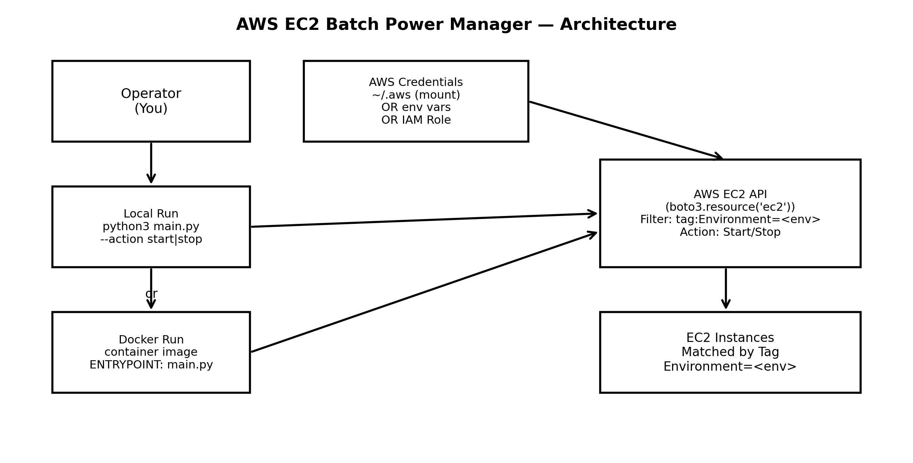

# AWS EC2 Batch Power Manager (Tag-Based) — Docker Ready

A lightweight CLI tool to **start or stop multiple EC2 instances at once** by filtering instances using a **tag key/value** (default: `Environment=Dev`).

This is useful for cost control in non-production environments (Dev/Test/Staging) by shutting down instances outside working hours.

---

## What it does

- Connects to AWS EC2 in a given region (default: `us-east-1`)
- Finds EC2 instances matching:
  - `tag:Environment = <env>` (default: `Dev`)
- Executes one action on all matching instances:
  - `--action start`
  - `--action stop`
- Logs progress and errors

> Note: The script does **not** wait for instance state changes to complete; it sends the start/stop request and exits.

---


[](https://github.com/emredogan-cloud/aws-environment-scheduler/actions/workflows/main.yaml)

## Architecture Diagram



## Requirements

- Python 3.8+
- AWS credentials configured (one of the following):
  - `aws configure` (recommended)
  - Environment variables (`AWS_ACCESS_KEY_ID`, `AWS_SECRET_ACCESS_KEY`, etc.)
  - IAM Role (if running on an EC2 instance)

### Install dependencies (local run)

```bash
pip install boto3 botocore
```

---

## Usage (Local)

### Stop all instances tagged `Environment=Dev` in `us-east-1`

```bash
python3 main.py --action stop
```

### Start all instances tagged `Environment=Dev` in `us-east-1`

```bash
python3 main.py --action start
```

### Choose a different environment tag value (example: `Staging`)

```bash
python3 main.py --action stop --env Staging
```

### Choose a different region (example: `eu-central-1`)

```bash
python3 main.py --action start --region eu-central-1
```

---

## CLI Arguments

| Argument   | Required | Default     | Description |
|-----------|----------|-------------|-------------|
| `--action`| ✅ Yes   | -           | `start` or `stop` |
| `--region`| ❌ No    | `us-east-1` | AWS region to target |
| `--env`   | ❌ No    | `Dev`       | Tag value for `Environment` |

The script uses:
- **Tag Key:** `Environment`
- **Tag Value:** comes from `--env`

---

## Example Tag Setup (AWS Console)

Make sure your EC2 instances have a tag like:

- Key: `Environment`
- Value: `Dev` (or `Staging`, `Test`, etc.)

Only instances matching the tag filter will be affected.

---

## IAM Permissions

The AWS identity running this tool needs permissions to describe and start/stop instances.

Example minimal policy:

```json
{
  "Version": "2012-10-17",
  "Statement": [
    {
      "Sid": "EC2BatchPowerManager",
      "Effect": "Allow",
      "Action": [
        "ec2:DescribeInstances",
        "ec2:StartInstances",
        "ec2:StopInstances"
      ],
      "Resource": "*"
    }
  ]
}
```

> You can restrict by region, tags, or instance ARNs for tighter security if needed.

---

## Docker Support (Containerized Run)

You can package and run this tool using Docker. This makes it easy to execute anywhere without setting up Python dependencies.

### 1) Example `Dockerfile`

Create a `Dockerfile` next to `main.py`:

```dockerfile
FROM python:3.12-slim
RUN apt-get update && apt-get upgrade -y

WORKDIR /app

# Install dependencies
RUN pip install --no-cache-dir requirements.txt

# Copy the script
COPY main.py 

# Default command (you will override args at runtime)
ENTRYPOINT ["python", "main.py"]
```

### 2) Build the image

```bash
docker build -t ec2-manager .
```

### 3) Run the container

#### Option A — Use your local AWS CLI credentials (~/.aws)

This is the most common approach. It mounts your local AWS config/credentials into the container.

```bash
docker run --rm   -v "$HOME/.aws:/root/.aws:ro"   ec2-batch-power-manager   --action stop --region us-east-1 --env Dev
```

#### Option B — Provide credentials via environment variables

```bash
docker run --rm   -e AWS_ACCESS_KEY_ID="YOUR_KEY"   -e AWS_SECRET_ACCESS_KEY="YOUR_SECRET"   -e AWS_SESSION_TOKEN="YOUR_SESSION_TOKEN"   ec2-batch-power-manager   --action start --region eu-central-1 --env Staging
```

> If you use AWS SSO or `credential_process`, Option A (mounting `~/.aws`) may be preferable.

---

## Notes & Safety

- Be careful running this in production environments.
- Stopping instances may cause downtime and data loss for workloads that are not designed for it.
- If instances are behind Auto Scaling Groups, they may automatically relaunch after being stopped depending on the configuration.

---

## Project Structure

```text
.
aws-environment-scheduler/
├── .github/
├── .gitignore
├── .dockerignore         
├── Dockerfile
├── LICENSE
├── main.py
├── README.md
└── requirements.txt
```

---

## License

MIT LICENSE
